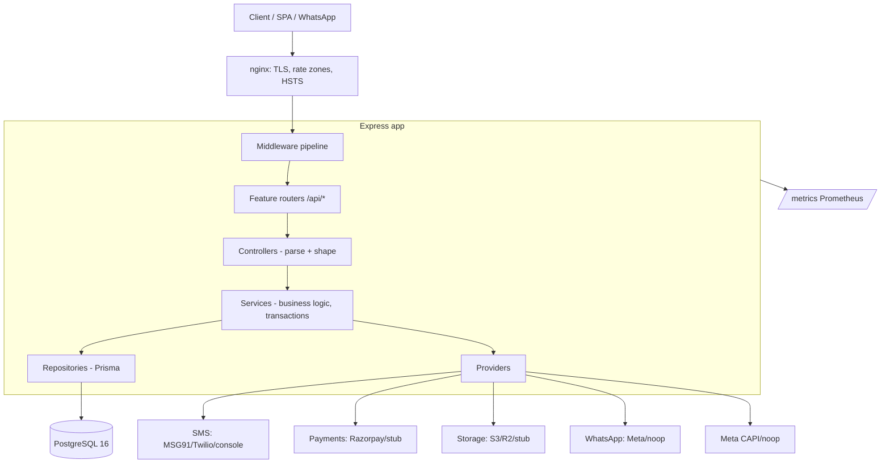
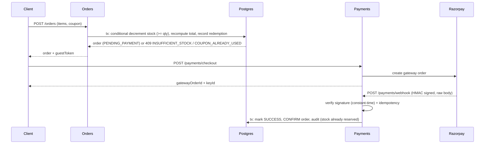
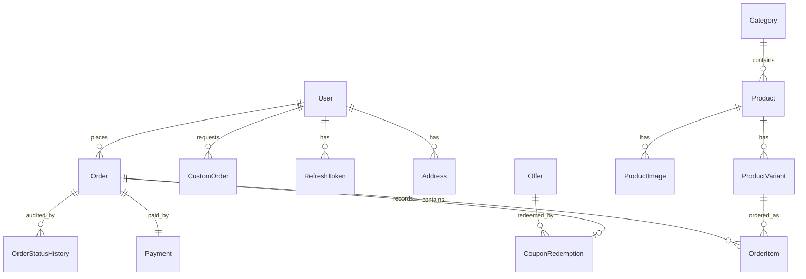
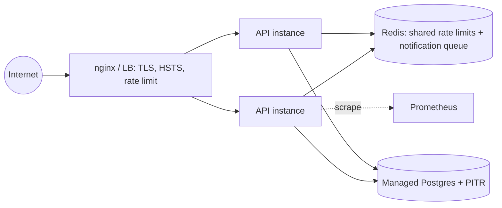

# Architecture

Runtime architecture of the Custom T-Shirt backend. For product/requirements history see
[`01_PRD.md`](01_PRD.md)–[`03_DESIGN.md`](03_DESIGN.md); for decisions see [`DECISIONS.md`](DECISIONS.md).

## 1. Layered architecture

A single stateless Express process with strict layer boundaries. Business logic lives only in
services; controllers are thin; all DB access is in repositories; third-party integrations are
pluggable providers that degrade to stubs when credentials are absent.



**Middleware pipeline** (order matters — [`src/app.ts`](src/app.ts)):
`trust proxy` → `httpsRedirect` → `helmet` (strict CSP) → `Permissions-Policy` → `cors` →
`json` (1MB + raw-body capture for webhooks) → `urlencoded(extended:false)` → `requestId` →
`requestTimeout` → `pino-http` → `metrics` → `/metrics` → `rateLimiter` (/api) → routes →
`notFound` → `errorHandler`.

**Base path:** `/api/v1` (canonical) and `/api` (back-compat alias) mount the same router;
the OpenAPI contract is served at `/api/v1/openapi.json` ([`src/docs/openapi.ts`](src/docs/openapi.ts)).

**Notifications** are dispatched via [`src/jobs/notification-queue.ts`](src/jobs/notification-queue.ts):
with `REDIS_URL` set, sends go to a BullMQ queue (5 attempts, exponential backoff; exhausted jobs
land in the failed set = dead-letter queue) delivered by an in-process worker; without Redis they
run inline. Dispatch never throws, so a notification failure cannot fail the payment webhook or an
admin money-path action.

## 2. Module map

```
src/
├─ config/            env (zod, fail-fast), prisma, cors, production-check (boot audit)
├─ middleware/        auth-guard, admin-guard, validate, rate-limit, error-handler,
│                     request-id, request-timeout, https-redirect, not-found, optional-auth
├─ modules/           feature modules (routes → controller → service → repository [→ schemas])
│  ├─ health          liveness / readiness / combined probes
│  ├─ auth            OTP + JWT + refresh rotation (+ sms/ provider factory)
│  ├─ products / categories / offers        catalog (public reads)
│  ├─ custom-orders   design wizard orders + presigned uploads (+ pricing)
│  ├─ orders          server-authoritative cart→order + stock reservation + coupons
│  ├─ payments        Razorpay checkout + webhook (+ providers/)
│  ├─ account         authenticated profile + order history
│  ├─ admin           API-key-guarded catalog/offer/order management
│  ├─ whatsapp        click-to-chat, Business API webhook, invoices
│  └─ contact         inbound inquiries
├─ notifications/     pluggable notification provider (meta / noop)
├─ jobs/              BullMQ notification queue (retry + DLQ with Redis; inline fallback)
├─ docs/              OpenAPI 3.0 contract generated from the module Zod schemas
├─ analytics/         Meta Conversions API (server-side events)
├─ storage/           S3-compatible presigned uploads (+ stub) + virus-scan provider hook
├─ observability/     Prometheus registry, HTTP + business/security metrics
├─ utils/             app-error, response envelope, jwt, crypto, audit, pagination, logger…
├─ types/             Express request augmentation (user, admin, id)
├─ app.ts             app assembly (middleware + routers)
└─ server.ts          boot: enforceProductionConfig() → listen → graceful shutdown
```

No circular dependencies; modules depend inward (controller→service→repository) and on `utils/`
and provider factories only.

## 3. Request lifecycle — server-authoritative checkout

The money path never trusts the client: totals are recomputed from DB prices, stock is reserved
atomically, and only a signature-verified webhook confirms the order.



## 4. Data model (core entities)



Money is `Decimal(10,2)`. Integrity guards: `CHECK (ProductVariant.stock >= 0)`, unique
`Payment.orderId`, unique `CouponRedemption(offerId,orderId)` + partial unique `(offerId,userId)`.
Append-only `AuditLog` and `OtpRequest`/`RefreshToken` store only **hashes** of secrets.

## 5. Security architecture

| Control           | Implementation                                                                                                                                                  |
| ----------------- | --------------------------------------------------------------------------------------------------------------------------------------------------------------- |
| AuthN             | OTP (bcrypt-hashed, single-use, expiry, per-number + per-IP limits) → JWT access (15m) + opaque refresh (30d, SHA-256 hashed, **rotated with reuse detection**) |
| AuthZ             | Ownership checks (404-on-deny) for orders/custom-orders; admin via constant-time API key(s) with per-label attribution                                          |
| Money/stock       | Server recomputes totals; atomic conditional decrement; DB CHECK; coupon caps                                                                                   |
| Webhooks          | HMAC-SHA256 over raw body, constant-time compare; idempotent; secrets required at boot                                                                          |
| Uploads           | Content-type allowlist, sanitized keys, server-reconstructed URLs, third-party URLs rejected                                                                    |
| Transport/headers | HSTS, strict CSP (`default-src 'none'`), `frameguard`, Permissions-Policy, HTTPS redirect                                                                       |
| Secrets           | Zod-validated env; distinct 32+ char JWT secrets; boot refuses placeholders/weak config                                                                         |
| Audit             | Append-only `AuditLog` for login/logout/reuse, admin auth + mutations, payment outcomes                                                                         |
| DoS               | Body-size cap, request timeout, per-route + global rate limiting (Redis-ready)                                                                                  |

## 6. Observability

- **Logs:** pino structured JSON, secret/PII redaction, `x-request-id` correlation.
- **Metrics:** Prometheus `/metrics` — default process metrics + `http_request_duration_seconds`,
  `http_requests_total`, `orders_created_total`, `payments_total{outcome}`,
  `auth_attempts_total{outcome}`, `rate_limit_trips_total{limiter}`,
  `notification_jobs_total{outcome}` (enqueued/delivered/retried/dead_letter/inline/error).
- **Probes:** `/health/live` (restart), `/health/ready` (traffic gate), `/health` (combined).
- **Audit trail:** `AuditLog` table for security/business events.
- **Tracing:** OpenTelemetry auto-instrumentation (http/express/pg), gated by `OTEL_ENABLED`,
  OTLP exporter via `OTEL_EXPORTER_OTLP_ENDPOINT` — see [`src/observability/tracing.ts`](src/observability/tracing.ts).
- **Ops:** Prometheus alert rules + Grafana dashboard in [`deploy/`](deploy/); runbooks in [`RUNBOOK.md`](RUNBOOK.md).

## 7. Deployment topology



Stateless instances scale horizontally behind the LB. Redis is provisioned in
[`docker-compose.prod.yml`](docker-compose.prod.yml) (AOF persistence, noeviction) and wired via
`REDIS_URL` for shared rate limits + the notification queue — **required before multi-instance**.
Migrations run via `prisma migrate deploy` (forward-only; roll back by restoring a DB snapshot,
not by down-migration).
